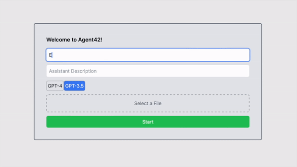

Awesome—here’s your README updated with the **Extended Project Scope** (Splunk, Selenium, AWS, VMware), cleanly woven into your existing structure. I kept your tone practical and added copy-pasteable snippets where helpful.

---

# OpenAI Assistant API Chat

**Owner/Maintainer:** [Dharma Kevadiya](https://github.com/Dharma2222)

[](https://vercel.com/new/clone?repository-url=https%3A%2F%2Fgithub.com%2FDharma2222%2FOpenAI-Assistant-API-Chat&env=OPENAI_API_KEY&envDescription=OpenAI%20API%20Key&envLink=https%3A%2F%2Fplatform.openai.com%2Faccount%2Fapi-keys&project-name=openai-assistant-api-chat&repository-name=OpenAI-Assistant-API-Chat)

<!-- Optional: add your live demo link when ready -->

<!-- [](https://your-demo-url.vercel.app) -->

## Introduction

Welcome! This project is a chat application that lets users talk with an AI assistant using the OpenAI API. The default model is **configurable** (e.g., `gpt-4o`, `gpt-4.1`, etc.) via environment variables. The app supports text chat, file uploads for analysis, and (optionally) image understanding.

> This repo is under active refactor (branch: `Code_refactor`) — \~90% complete.

---

## Features

* **Configurable Assistant**: Set assistant name/model/description for a custom experience.
* **Interactive Chat**: Real-time, context-aware conversations.
* **File Uploads**: Send files for the assistant to analyze.
* **Vision (optional)**: Send images and get descriptions/analysis (model dependent).
* **Function Calls** *(Coming Soon)*: Trigger actions/APIs based on chat context.
* **Code Execution** *(Coming Soon)*: Run lightweight Python code for analysis.

---

## Quick Start

### Prerequisites

* **Node.js** (LTS recommended)
* **OpenAI API key**

### Install

```bash
git clone https://github.com/Dharma2222/OpenAI-Assistant-API-Chat.git
cd OpenAI-Assistant-API-Chat
npm install
```

### Environment

Create a `.env` file in the project root:

```env
# Required
OPENAI_API_KEY=your_openai_api_key

# Optional model selection
# OPENAI_MODEL=gpt-4o
# OPENAI_MODEL=gpt-4.1

# Optional: if the UI expects a default assistant id (client-side)
# REACT_APP_ASSISTANT_ID=asst_xxxxxxxxxxxxxxxxxxxxx
```

> If you’re using client-side envs, match your framework conventions (e.g., `NEXT_PUBLIC_*` for Next.js, `VITE_*` for Vite).

### Run (Dev)

```bash
npm run dev
```

---

## One-Click Deploy (Vercel)

Deploy this repository on Vercel:

[](https://vercel.com/new/clone?repository-url=https%3A%2F%2Fgithub.com%2FDharma2222%2FOpenAI-Assistant-API-Chat&env=OPENAI_API_KEY&envDescription=OpenAI%20API%20Key&envLink=https%3A%2F%2Fplatform.openai.com%2Faccount%2Fapi-keys&project-name=openai-assistant-api-chat&repository-name=OpenAI-Assistant-API-Chat)

Deploy with both **OpenAI API Key** and a **default Assistant ID**:

[](https://vercel.com/new/clone?repository-url=https%3A%2F%2Fgithub.com%2FDharma2222%2FOpenAI-Assistant-API-Chat&env=OPENAI_API_KEY,REACT_APP_ASSISTANT_ID&envDescription=OpenAI%20API%20Key,Assistant%20ID&envLink=https%3A%2F%2Fplatform.openai.com%2Faccount%2Fapi-keys&project-name=openai-assistant-api-chat&repository-name=OpenAI-Assistant-API-Chat)

---

## Application Architecture

### High-Level Flow

* **ChatManager (`ChatManager.ts`)**: Central controller for chat state and operations.
* **API Layer (`api.js`)**: Front-end wrapper for calling API routes.
* **Assistant Modules (`assistantModules.ts`)**: Prepare uploads, initialize assistants, create threads.
* **Chat Modules (`chatModules.ts`)**: Submit user messages, fetch assistant replies, update UI state.
* **React UI**: Components like `WelcomeForm`, `InputForm`, `MessageList` connect to `ChatManager`.

#### Diagram (conceptual)

```
[React UI] → [ChatManager] → [API Layer] → [/api routes] → [OpenAI API]
         ↘──────────────────────── state/messages ─────────────────────↗
```

---

## Detailed Modules

### `ChatManager.ts`

* **Role**: Singleton managing chat state (messages, status, assistant/thread IDs).
* **Key Methods**:

  * `startAssistant(assistantDetails, file, initialMessage)`
  * `sendMessage(input)`
  * `getChatState()`

```ts
class ChatManager {
  private state: ChatState;
  private static instance: ChatManager | null = null;
  private constructor(setChatMessages: (m: any[]) => void, setStatusMessage: (s: string) => void) {
    this.state = { /* ... */ };
  }
  public static getInstance(setChatMessages: (m: any[]) => void, setStatusMessage: (s: string) => void) {
    if (!this.instance) this.instance = new ChatManager(setChatMessages, setStatusMessage);
    return this.instance;
  }
  async startAssistant(assistantDetails: any, file: File | null, initialMessage: string) { /* ... */ }
  async sendMessage(input: string) { /* ... */ }
  getChatState(): ChatState { return this.state; }
}
```

### `api.js`

* **Purpose**: Clean front-end API entrypoint.
* **Examples**:

  * `uploadImageAndGetDescription(base64Image)`
  * `createAssistant(assistantDetails)`
  * `createThread()`, `runAssistant()`

```js
export const uploadImageAndGetDescription = async (base64Image) => {
  // call server route, which calls OpenAI Vision if enabled
};
```

### `assistantModules.ts`

* **Purpose**: Assistant setup operations.
* **Key Functions**:

  * `prepareUploadFile(file, setStatusMessage)`
  * `initializeAssistant(assistantDetails, fileId)`
  * `createChatThread(initialMessage)`

### `chatModules.ts`

* **Purpose**: Chat message lifecycle.
* **Key Functions**:

  * `submitUserMessage(input, threadId)`
  * `fetchAssistantResponse(runId, threadId)`
  * `updateChatState(prev, next, setChatMessages)`

---

## Front-End

* **Hooks**: `useChatState.ts` to bind UI with `ChatManager`.
* **Components**:

  * **`WelcomeForm`**: collect assistant details / seed message
  * **`InputForm`**: send user messages
  * **`MessageList`**: render conversation

---

## API Routes (`/api/*.ts`)

Serverless endpoints that interact with the OpenAI API:

* `POST /api/assistant/create`
* `POST /api/thread/create`
* `POST /api/run/start`
* `GET  /api/messages/list`
* `GET  /api/run/status`
* etc.

> Adjust exact filenames/paths to your framework (Next.js, Express, etc.).

---

# Extended Project Scope

**Currently**

* **Frontend:** React + TypeScript
* **Backend:** Next.js API routes (serverless)
* **AI Core:** OpenAI Assistants API (text + vision)
* **Optional Add-on:** Python backend / Code Interpreter

**Now Adding**

* **Splunk:** centralized logging, monitoring, usage analytics
* **Selenium:** browser automation for web UI + chat flows
* **AWS:** infra + deployment (Lambda, S3, CloudFormation, Cognito, CloudWatch)
* **VMware:** virtualization/lab environment for dev/QA/prod-like testing

---

## Where Each Technology Fits

### 1) Splunk — Monitoring & Analytics

Ship logs from **Next.js API routes** and the **Python backend** (if enabled) to **Splunk**. Build dashboards for:

* User interactions (queries, file uploads, errors)
* API latency (OpenAI + Python service)
* System health (uptime, error trends)

**Example dashboard ideas**

* “Top 10 user queries”
* “Average response time per API route”
* “Error rate by endpoint (5xx/4xx)”

**Minimal HEC (HTTP Event Collector) log example (Next.js route)**

```ts
// /pages/api/log.ts
export default async function handler(req, res) {
  const event = { level: 'info', route: '/api/log', body: req.body, ts: Date.now() };
  await fetch(process.env.SPLUNK_HEC_URL!, {
    method: 'POST',
    headers: {
      'Authorization': `Splunk ${process.env.SPLUNK_HEC_TOKEN}`,
      'Content-Type': 'application/json'
    },
    body: JSON.stringify({ event, source: 'nextjs', sourcetype: '_json', host: 'assistant-app' })
  });
  res.status(200).json({ ok: true });
}
```

**Env**

```env
SPLUNK_HEC_URL=https://splunk.example.com:8088/services/collector
SPLUNK_HEC_TOKEN=xxxx-xxxx-xxxx
```

---

### 2) Selenium — Automated Testing

Use **Selenium WebDriver** to test the chat UI across **Chrome/Firefox/Edge**. Automate:

* Login (including **Cognito MFA** if enabled)
* Send messages / upload files
* Assert responses render correctly
* Validate file download/preview

**Smoke test sketch (JS)**

```js
import { Builder, By, until } from 'selenium-webdriver';
(async () => {
  const driver = await new Builder().forBrowser('chrome').build();
  try {
    await driver.get(process.env.APP_URL);
    await driver.findElement(By.id('login')).click();
    // ... perform Cognito login flow ...
    await driver.wait(until.elementLocated(By.css('#message-input')), 10000);
    await driver.findElement(By.css('#message-input')).sendKeys('Hello');
    await driver.findElement(By.css('#send-btn')).click();
    await driver.wait(until.elementLocated(By.css('.assistant-reply')), 10000);
  } finally {
    await driver.quit();
  }
})();
```

---

### 3) AWS — Infrastructure & Services

* **Cognito** → authentication (MFA, RBAC)
* **S3** → file uploads (CSV, Excel, images)
* **Lambda** → serverless jobs (e.g., preprocess uploads, notify Splunk)
* **CloudFormation** → declarative provisioning of buckets, roles, policies, Lambdas, API gateways
* **CloudWatch** → logs/metrics/alarms (run parallel to Splunk)

**Typical upload flow**

```
Client → S3 (putObject) → S3 Event → Lambda (preprocess/notify) → Splunk/CloudWatch → Next.js/Python → OpenAI → UI
```

**CloudFormation sketch (YAML)**

```yaml
Resources:
  UploadBucket:
    Type: AWS::S3::Bucket
    Properties:
      BucketName: !Sub assistant-uploads-${AWS::AccountId}
      NotificationConfiguration:
        LambdaConfigurations:
          - Event: "s3:ObjectCreated:*"
            Function: !GetAtt UploadLambda.Arn

  UploadLambda:
    Type: AWS::Lambda::Function
    Properties:
      Handler: index.handler
      Runtime: nodejs20.x
      Role: !GetAtt UploadLambdaRole.Arn
      Code:
        ZipFile: |
          exports.handler = async (event) => { /* parse S3 event, log to Splunk, invoke processing */ };

  UploadLambdaPermission:
    Type: AWS::Lambda::Permission
    Properties:
      Action: lambda:InvokeFunction
      FunctionName: !Ref UploadLambda
      Principal: s3.amazonaws.com
      SourceArn: !GetAtt UploadBucket.Arn
```

---

### 4) VMware — Virtualization & Lab Setup

Use **VMware Workstation/ESXi** to simulate multi-environment deployments (Dev/QA/Prod) and validate scaling/fault-tolerance offline.

**Example lab topology**

* **VM1:** Next.js + React frontend
* **VM2:** Python backend (FastAPI + Pandas)
* **VM3:** Splunk server (or HEC + dashboards)
* **VM4:** Selenium test runner (Chrome/Firefox headless)

---

## Extended Architecture (Simplified)

```text
[React UI]
   ↓
[Next.js API routes]  → logs → [Splunk / CloudWatch]
   ↓
[Python API (FastAPI)]  (optional for data analysis)
   ↓
[OpenAI Assistants API] ↔ [Code Interpreter]
   ↓
Results → UI

File Uploads → [S3 Bucket] → [Lambda Trigger] → Process → Logs → Splunk
Testing → [Selenium scripts] on [VMware lab]
Infra → [CloudFormation templates] for reproducible AWS setup
```


---

## Usage Examples 

* **Splunk:** “Implemented centralized logging by forwarding chat activity, API responses, and error logs from Next.js/Lambda to Splunk, enabling real-time monitoring of user behavior and system health.”
* **Selenium:** “Built Selenium WebDriver test suite to automate chat workflows (login, file upload, message exchange) and integrated it into CI for regression coverage.”
* **AWS:** “Deployed frontend on Amplify (or CloudFront), backend as Lambda + API Gateway, file storage on S3, and used CloudFormation to provision Cognito and IAM policies.”
* **VMware:** “Configured a VMware sandbox with isolated VMs for frontend, backend, Splunk, and Selenium to simulate production-like conditions and validate fault tolerance.”

---

##  CI for Selenium (GitHub Actions)

```yaml
name: e2e
on: [push, pull_request]
jobs:
  selenium-e2e:
    runs-on: ubuntu-latest
    steps:
      - uses: actions/checkout@v4
      - uses: actions/setup-node@v4
        with: { node-version: '20' }
      - run: npm ci
      - name: Start dev server
        run: npm run dev & sleep 8
      - name: Run Selenium smoke
        run: node tests/selenium/smoke.test.js
        env:
          APP_URL: http://localhost:3000
```

---

## Assets

**Demo/GIF**

```html
<!-- Update the path if your assets folder differs -->

```

---

## Contributing

1. Open an issue for bugs/ideas.
2. Fork the repo and create a feature branch.
3. Submit a PR with a clear description and screenshots if UI changes.

---

## Roadmap

* [ ] Function calling (tools/actions)
* [ ] Code interpreter (Python sandbox)
* [ ] Multi-file uploads with better previews
* [ ] Improved error boundaries & retries
* [ ] Theme & accessibility polish
* [ ] Splunk dashboards (latency, top queries, error heatmap)
* [ ] Selenium cross-browser matrix (Chrome, Firefox, Edge)

---

## License

MIT © [Dharma Kevadiya](https://github.com/Dharma2222)

---

## Acknowledgements

* OpenAI API team & docs

---

